# java Script  Browser Or window object

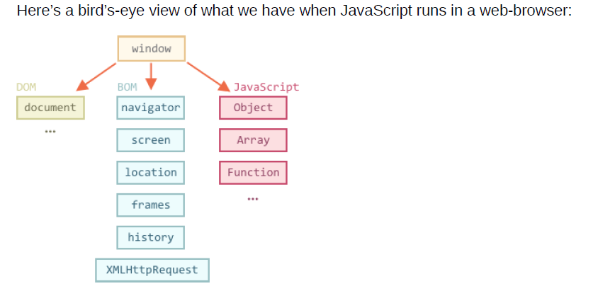

### javascript standards support

Here we used document.body.style , but there’s much, much more.

Properties and methods are described in the specification:

[DOM Living Standard](https://dom.spec.whatwg.org/)

### CSSOM for styling

CSS rules and stylesheets are not structured like HTML. There’s a separate
specification CSSOM that explains how they are represented as objects and how to read and write them.
CSSOM is used together with DOM when we modify style rules for the
document. In practice though, CSSOM is rarely required, because usually
CSS rules are static. We rarely need to add/remove CSS rules from
JavaScript, so we won’t cover it right now.

[CSS Object Models](https://www.w3.org/TR/cssom-1/)

## BOM (Browser object model)

    Browser Object Model (BOM) are additional objects provided by the browser (host environment) to work with everything except the document.

  1. The navigator  object provides background information about the browser
and the operating system. There are many properties, but the two most widely
known are: navigator.userAgent – about the current browser, and
navigator.platform – about the platform (can help to differ between
Windows/Linux/Mac etc).

  2. The location  object allows us to read the current URL and can redirect the
browser to a new one.
Here’s how we can use the location object:

Functions alert/confirm/prompt are also a part of BOM: they are directly
not related to the document, but represent pure browser methods of
communicating with the user.

## BOM is the part of the general [BOM](https://html.spec.whatwg.org/)

Yes, you heard that right. The HTML spec at <b> https://html.spec.whatwg.org </b>  is
not only about the “HTML language” (tags, attributes), but also covers a bunch of
objects, methods and browser-specific DOM extensions. That’s “HTML in broad

## DOM tree

    The backbone of an HTML document are tags.
    According to Document Object Model (DOM), every HTML-tag is an object.
    Nested tags are called “children” of the enclosing one.

    The text inside a tag it is an object as well.
    All these objects are accessible using JavaScript.

### An example of DOM

   For instance, let’s explore the DOM for this document

       `html
       <!DOCTYPE HTML>
        <html>
        <head>
        <title>About elks</title>
        </head>
        <body>
        The truth about elks.
        </body>
        </html>`

The DOM represents HTML as a tree structure of tags. Here’s how it looks:

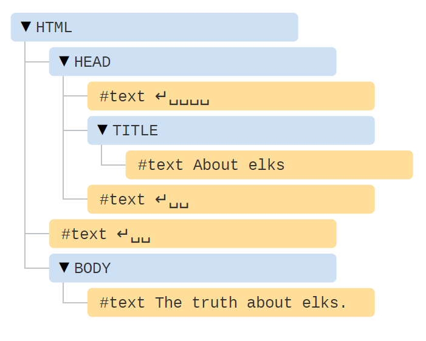

Tags are called element nodes (or just elements). Nested tags become children of
the enclosing ones. As a result we have a tree of elements: <html> is at the
root, then <head> and <body> are its children, etc.
The text inside elements forms text nodes, labelled as #text . A text node
contains only a string. It may not have children and is always a leaf of the tree.
For instance, the <title> tag has the text "About elks"

Please note the special characters in text nodes:
    a newline: ↵ (in JavaScript known as \n )
    a space: ␣

## Autocorrection

    If the browser encounters malformed HTML, it automatically corrects it when making DOM.
    For instance, the top tag is always <html> . Even if it doesn’t exist in the document – it will exist in the DOM, the browser will create it. The same goes for <body> .
    As an example, if the HTML file is a single word "Hello" , the browser will wrap it into <html> and <body> , add the required <head> , and the DOM will be:

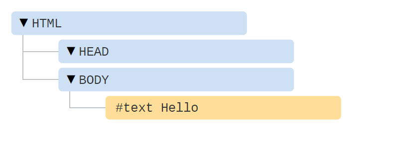
    While generating the DOM, browsers automatically process errors in the document, close tags and so on. Such an document with unclosed tags:

    ```HtML

        <p>Hello
        <li>Mom
        <li>and
        <li>Dad
    ```
    Will become a normal DOM, as the browser reads tags and restores the missing parts:
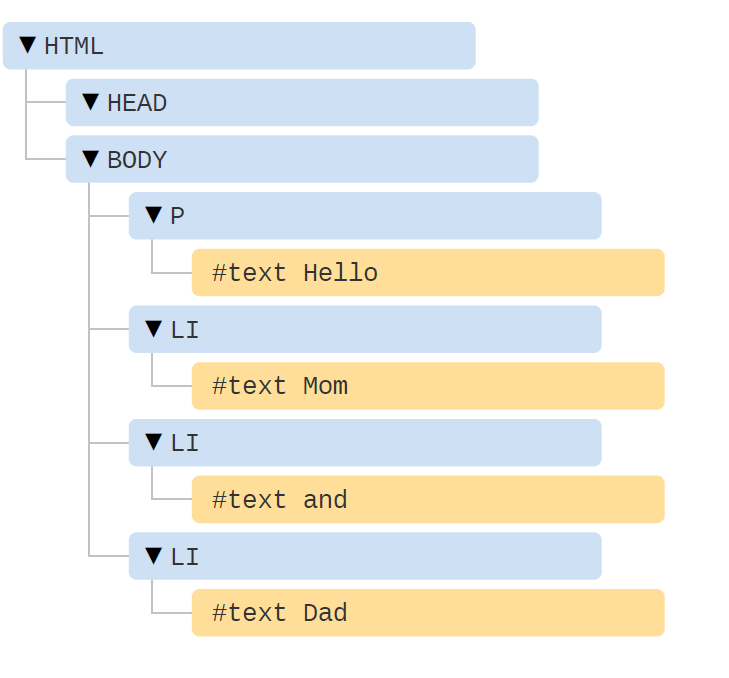

### Tables always have <tbody>

An interesting “special case” is tables. By the DOM specification they must
have <tbody> , but HTML text may (officially) omit it. Then the browser
creates <tbody> in DOM automatically.
For the HTML:

``` Code example
<table id="table">
    <tr>
        <td>1</td>
    </tr>
</table>
```

DOM-structure will be:
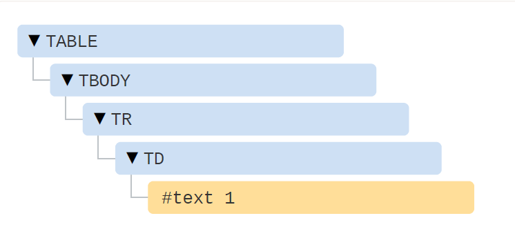

You see? The <tbody> appeared out of nowhere. You should keep this in
mind while working with tables to avoid surprises.

## Another Example

``` HTML
    <!DOCTYPE HTML>
    <html>
    <body>
    The truth about elks.
    <ol>
    <li>An elk is a smart</li>
    <!-- comment -->
    <li>...and cunning animal!</li>
    </ol>
    </body>
    </html>
```

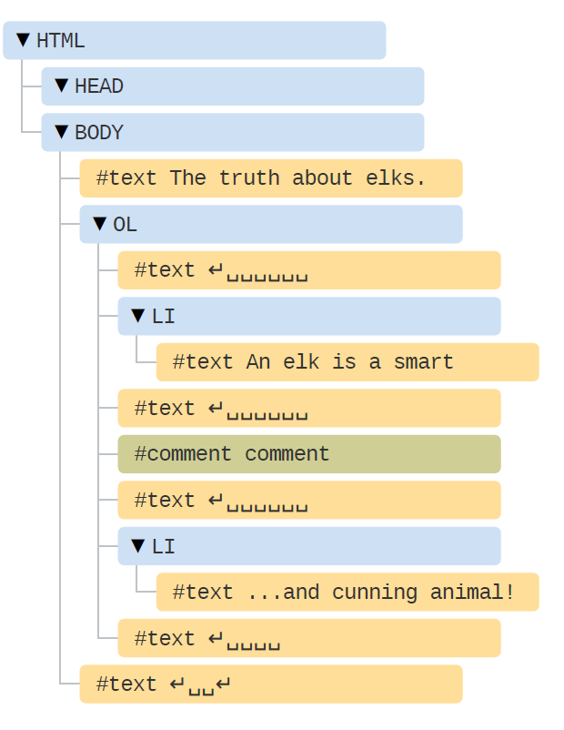

Here we see a new tree node type – comment node, labeled as #comment .
We may think – why is a comment added to the DOM? It doesn’t affect the visual
representation in any way. But there’s a rule – if something’s in HTML, then it also
must be in the DOM tree.

### ***Everything in HTML, even comments, becomes a part of the DOM.***

Even the <!DOCTYPE...> directive at the very beginning of HTML is also a
DOM node. It’s in the DOM tree right before <html> . We are not going to touch
that node, we even don’t draw it on diagrams for that reason, but it’s there.
The document object that represents the whole document is, formally, a DOM
node as well.
There are 12 node types  . In practice we usually work with 4 of them:

1. document – the “entry point” into DOM.
2. element nodes – HTML-tags, the tree building blocks.
3. text nodes – contain text.
4. comments – sometimes we can put the information there, it won’t be shown,
but JS can read it from the DOM.

### In the browser inspector

Another way to explore the DOM is to use the browser developer tools. Actually,
that’s what we use when developing.
To do so, open the web-page elks.html, turn on the browser developer tools and
switch to the Elements tab.

``` html
<!DOCTYPE HTML>
<html>
<body>
  The truth about elks.
  <ol>
    <li>An elk is a smart</li>
    <!-- comment -->
    <li>...and cunning animal!</li>
  </ol>
</body>
</html>
```

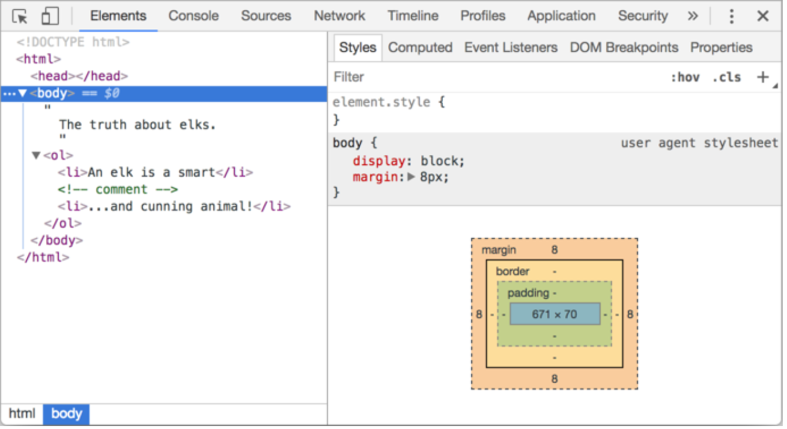

You can see the DOM, click on elements, see their details and so on.
Please note that the DOM structure in developer tools is simplified. Text nodes are
shown just as text. And there are no “blank” (space only) text nodes at all. That’s
fine, because most of the time we are interested in element nodes.
Clicking the button in the left-upper corner allows to choose a node from the
webpage using a mouse (or other pointer devices) and “inspect” it (scroll to it in
the Elements tab). This works great when we have a huge HTML page (and
corresponding huge DOM) and would like to see the place of a particular element in it.
Another way to do it would be just right-clicking on a webpage and selecting
“Inspect” in the context menu.

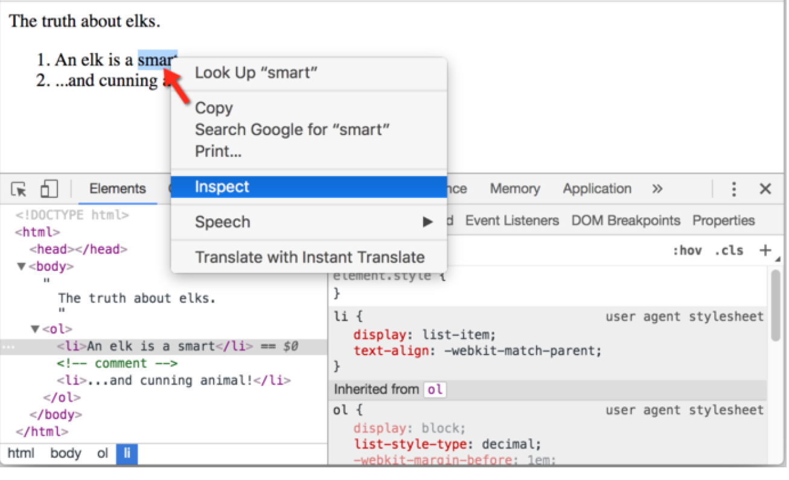

At the right part of the tools there are the following subtabs:

1. ***</b>Styles*** – we can see CSS applied to the current element rule by rule, including
    built-in rules (gray). Almost everything can be edited in-place, including the dimensions/margins/paddings of the box below.
2. ***Computed*** – to see CSS applied to the element by property: for each property  we can see a rule that gives it (including CSS inheritance and such).
3. ***Event Listeners*** – to see event listeners attached to DOM elements (we’ll cover them in the next part of the tutorial).

### Interaction with console

As we explore the DOM, we also may want to apply JavaScript to it. Like: get a
node and run some code to modify it, to see the result. Here are few tips to travel between the Elements tab and the console.
1.Select the first <li> in the Elements tab.
2.Press Esc – it will open console right below the Elements tab.
Now the last selected element is available as $0 , the previously selected is $1 etc.
We can run commands on them. For instance, $0.style.background = 'red' makes the selected list item red, like this

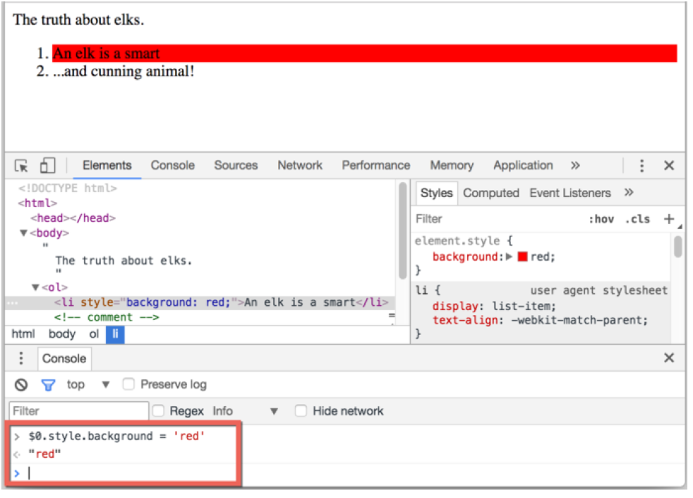
From the other side, if we’re in console and have a variable referencing a DOM node, then we can use the command inspect(node) to see it in the Elements pane.
Or we can just output it in the console and explore “at-place”, like document.body below:

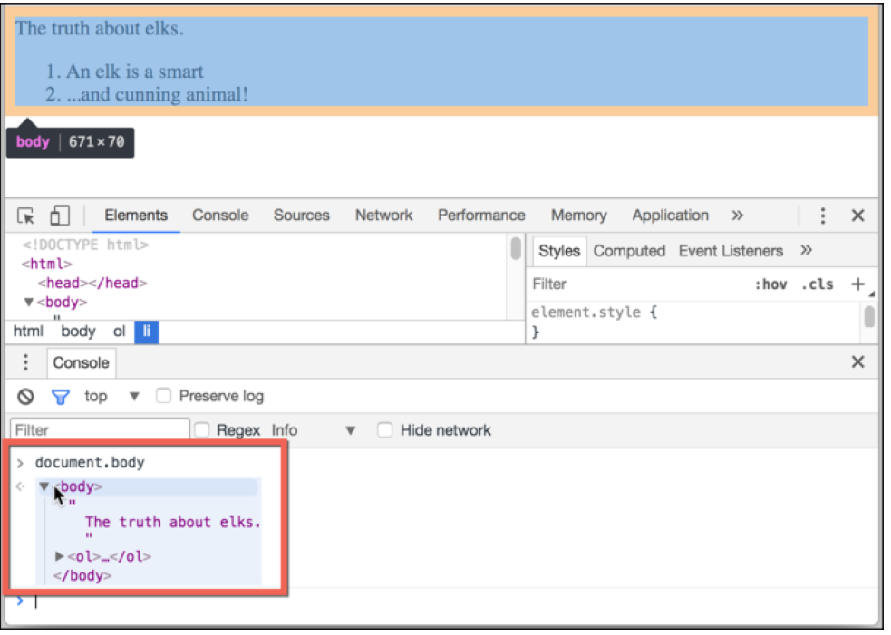

That’s for debugging purposes of course. From the next chapter on we’ll access and modify DOM using JavaScript.
The browser developer tools are a great help in development: we can explore the DOM, try things and see what goes wrong.

An HTML/XML document is represented inside the browser as the DOM tree.
Tags become element nodes and form the structure. Text becomes text nodes.
 Everything in HTML has its place in DOM, even comments.
We can use developer tools to inspect DOM and modify it manually.
Here we covered the basics, the most used and important actions to start with. There’s an extensive documentation about Chrome Developer Tools at <https://developers.google.com/web/tools/chrome-devtools> . The best way to learn the tools is to click here and there, read menus: most options are obvious. Later, when you know them in general, read the docs and pick up the rest.

DOM nodes have properties and methods that allow to travel between them, modify, move around the page and more.

## Walking the DOM

The DOM allows us to do anything with elements and their contents, but first we need to reach the corresponding DOM object.

All operations on the DOM start with the document object. From it we can access any node.
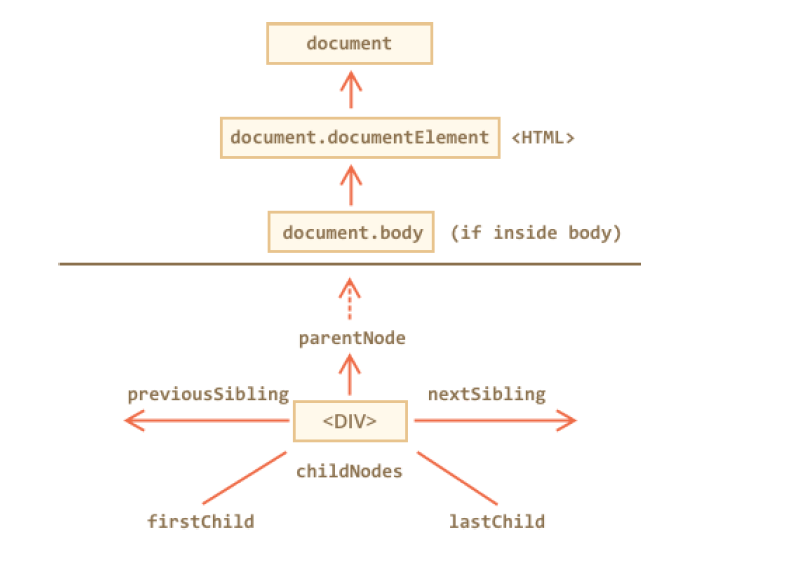

### <strong> On top: documentElement and body </strong>

The topmost tree nodes are available directly as document properties:

``` html
<html> = document.documentElement
The topmost document node is <b> document.documentElement </b> . That’s DOM node of <html> tag.
<body> = document.body
Another widely used DOM node is the <body> element – document.body .
<head> = document.head
The <head> tag is available as document.head .
```

#### **There’s a catch: document.body can be null**

A script cannot access an element that doesn’t exist at the moment of running.
In particular, if a script is inside <head> , then document.body is unavailable, because the browser did not read it yet.
So, in the example below the first alert shows null :

``` html
    <html>
        <head>
            <script>
            alert( "From HEAD: " + document.body ); // null, there's no <body> yet
            </script>
        </head>
        <body>
            <script>
            alert( "From BODY: " + document.body ); // HTMLBodyElement, now it exists
            </script>
        </body>
    </html>
```

### **In the DOM world null means “doesn’t exist”**

In the DOM, the null value means “doesn’t exist” or “no such node”.

## **Children: childNodes, firstChild, lastChild**

There are two terms that we’ll use from now on:

1. **Child nodes (or children)** – elements that are direct children. In other words,
they are nested exactly in the given one. For instance, <head> and <body> are children of <html> element.
2. **Descendants** – all elements that are nested in the given one, including children, their children and so on.

For instance, here <body> has children <div> and <ul> (and few blank text nodes):

``` html
<html>
    <body>
        <div>Begin</div>
        <ul>
            <li>
                <b>Information</b>
            </li>
        </ul>
    </body>
</html>
```

all descendants of <body> are not only direct children <div> , <ul> but
also more deeply nested elements, such as <li> (a child of <ul> ) and <b> (a child of <li> ) – the entire subtree.

## **The childNodes collection provides access to all child nodes, including text nodes.**

``` html
<html>
    <body>
        <div>Begin</div>

        <ul>
            <li>Information</li>
        </ul>
        <div>End</div>

        <script>

        for (let i = 0; i < document.body.childNodes.length; i++) {
        alert( document.body.childNodes[i] ); // Text, DIV, Text, UL, ..., SCRIPT
        }

        </script>
        <!-- ...more stuff... -->
    </body>
</html>
```

Please note an interesting detail here. If we run the example above, the last element shown is <script> . In fact, the document has more stuff below, but at
the moment of the script execution the browser did not read it yet, so the script doesn’t see it.

## **DOM collections**

As we can see, childNodes looks like an array. But actually it’s not an array, but rather a collection – a special array-like iterable object.

There are two important consequences:

1. We can use **for..of** to iterate over it:

``` javascript
for (let node of document.body.childNodes) {
    alert(node); // shows all nodes from the collection
}
```

That’s because it’s iterable (provides the **Symbol.iterator** property, as required).

2. Array methods won’t work, because it’s not an array:

``` javascript

alert(document.body.childNodes.filter); // undefined (there's no filter method!)
```

The first thing is nice. The second is tolerable, because we can use **Array.from** to create a “real” array from the collection, if we want array methods:

``` javascript
alert( Array.from(document.body.childNodes).filter ); // now it's there
```

## DOM collections are read-only

DOM collections, and even more – all navigation properties listed in this chapter are read-only.

## DOM collections are live

Almost all DOM collections with minor exceptions are live. In other words, they reflect the current state of DOM.

``` htm
<body>
<script>
// shows 0, 1, length, item, values and more.
for (let prop in document.body.childNodes) alert(prop);
</script>
</body>
```

## **Siblings and the parent**

*Siblings* are nodes that are children of the same *parent*. For instance, <head> and <body> are siblings:

``` html
-<body> is said to be the “next” or “right” sibling of <head> ,
-<head> is said to be the “previous” or “left” sibling of <body> .
```

The parent is available as **parentNode** .
The next node in the same parent (next sibling) is **nextSibling** , and the
previous one is **previousSibling** .

``` html
<html><head></head><body><script>
// HTML is "dense" to evade extra "blank" text nodes.
// parent of <body> is <html>
alert( document.body.parentNode === document.documentElement ); // true
// after <head> goes <body>
alert( document.head.nextSibling ); // HTMLBodyElement
// before <body> goes <head>
alert( document.body.previousSibling ); // HTMLHeadElement
</script></body></html>
```

## **Element-only navigation**

Navigation properties listed above refer to all nodes. For instance, in childNodes we can see both text nodes, element nodes, and even comment nodes if there exist.

But for many tasks we don’t want text or comment nodes. We want to manipulate element nodes that represent tags and form the structure of the page.
So let’s see more navigation links that only take element nodes into account:
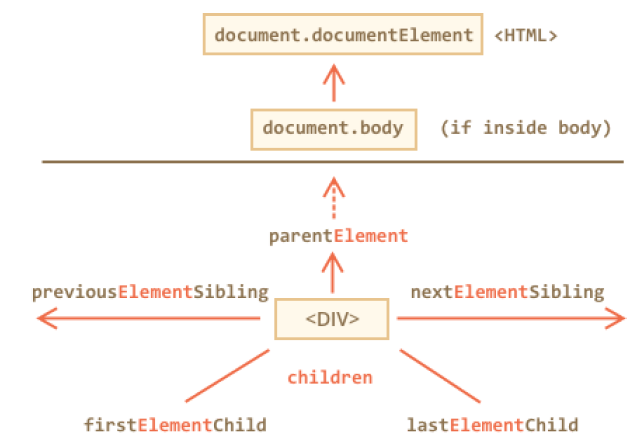

The links are similar to those given above, just with **Element** word inside:

- **children** – only those children that are element nodes
- **firstElementChild , lastElementChild** – first and last element children.
- **previousElementSibling , nextElementSibling** – neighbour elements.
- **parentElement** – parent element

## **document.getElementById or just id**

If an element has the id attribute, then there’s a global variable by the name from that id .
We can use it to immediately access the element no matter where it is:

``` html
<div id = "elem">
        <div id="elem-content">Element</div>
</div>
<script>
    alert(elem); // DOM-element with id="elem"
    alert(window.elem); // accessing global variable like this also works
    // for elem-content things are a bit more complex
    // that has a dash inside, so it can't be a variable name
    alert(window['elem-content']); // ...but accessible using square brackets [...]
</script>
```

*document.getElementById(id)*

``` html
<div id="elem">
    <div id="elem-content">Element</div>
</div>
<script>
    let elem = document.getElementById('elem');
    elem.style.background = 'red';
</script>
```
**There can be only one**
The id must be unique. There can be only one element in the document with the given id .
If there are multiple elements with the same id , then the behavior of corresponding methods is unpredictable. The browser may return any of them at random. So please stick to the rule and keep id unique.
