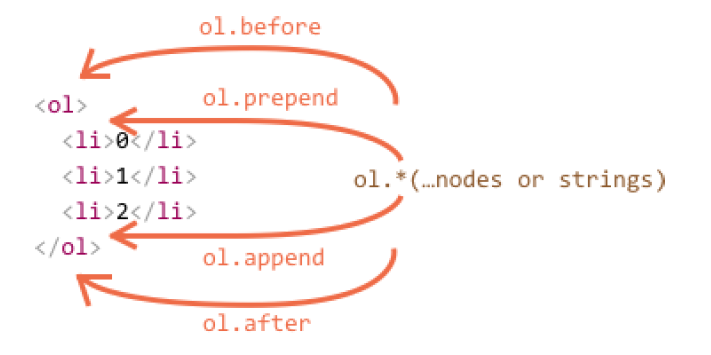
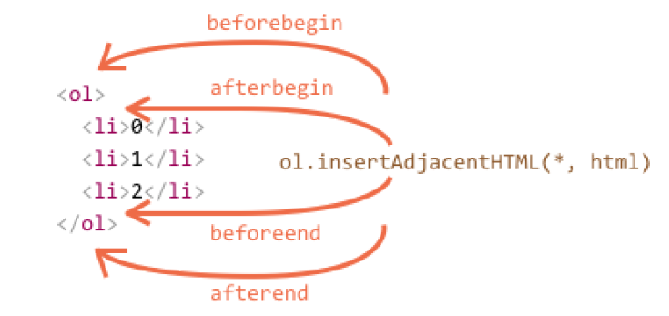

## Modifying the document

DOM modifications is the key to create “live” pages.

Here we’ll see how to create new elements “on the fly” and modify the existing page content.

First we’ll see a simple example and then explain the methods.

### Creating an element

To create DOM nodes, there are two methods:

**document.createElement(tag)**

Creates a new element node with the given tag:

let div = document.createElement('div');

**document.createTextNode(text)**

Creates a new text node with the given text:

**Creating the message**
In our case we want to make a div with given classes and the message in it:

```javascript
let div = document.createElement('div');
div.className = "alert alert-success";
div.innerHTML = "<strong>Hi there!</strong> You've read an important message.";
```

After that, we have our DOM element ready. Right now it is just in a variable and we cannot see it. That is because it’s not yet inserted into the page

**Insertion methods**

To make the div show up, we need to insert it somewhere into document .  
For instance, in **document.body** . There’s a special method **appendChild** for that: **document.body.appendChild(div) .**

```javascript
<style>
.alert {
padding: 15px;
border: 1px solid #d6e9c6;
border-radius: 4px;
color: #3c763d;
background-color: #dff0d8;
}
</style>
<script>
let div = document.createElement('div');
div.className = "alert alert-success";
div.innerHTML = "<strong>Hi there!</strong> You've read an important message.";
document.body.appendChild(div);
</script>
```

**parentElem.appendChild(node)**

Appends node as the last child of parentElem . The following example adds a new `<li>` to the end of `<ol>` :

```javascript
<!DOCTYPE html>
<html lang="en">
  <head>
    <meta charset="UTF-8" />
    <meta name="viewport" content="width=device-width, initial-scale=1.0" />
    <title>Document</title>
  </head>
  <body>
    <ol id="list">
      <li>0</li>
      <li>1</li>
      <li>2</li>
    </ol>
    <script>
      let newLi = document.createElement("li");
      newLi.innerHTML = "Hello, world!";
      list.appendChild(newLi);
    </script>
  </body>
</html>

```

**parentElem.insertBefore(node, nextSibling)**

Inserts node before nextSibling into parentElem . The following code inserts a new list item before the second `<li>` :

```javascript

<!DOCTYPE html>
<html lang="en">
  <head>
    <meta charset="UTF-8" />
    <meta name="viewport" content="width=device-width, initial-scale=1.0" />
    <title>Parent Element Before Insert</title>
  </head>
  <body>
    <ol id="list">
      <li>0</li>
      <li>1</li>
      <li>2</li>
    </ol>
    <script>
      let newLi = document.createElement("li");
      newLi.innerHTML = "Hello, world!";
      list.insertBefore(newLi, list.children[1]);
    </script>
  </body>
</html>

```

**parentElem.replaceChild(node, oldChild)**

Replaces oldChild with node among children of parentElem

All these methods return the inserted node. In other words, parentElem.appendChild(node) returns node . But usually the returned value is not used, we just run the method.

***prepend/append/before/after***

This set of methods provides more flexible insertions:

1. node.append(...nodes or strings) – append nodes or strings at the end of node ,
2. node.prepend(...nodes or strings) – insert nodes or strings into the beginning of node ,
3. node.before(...nodes or strings) –- insert nodes or strings before the node ,
4. node.after(...nodes or strings) –- insert nodes or strings after the node ,
5. node.replaceWith(...nodes or strings) –- replaces node with the given nodes or strings.

All of them accept a list of DOM nodes and/or text strings. If a string is given it’s inserted as a text node.

Here’s an example of using these methods to add more items to a list and the text before/after it:

```javascript
<!DOCTYPE html>
<html lang="en">
  <head>
    <meta charset="UTF-8" />
    <meta name="viewport" content="width=device-width, initial-scale=1.0" />
    <title>Document</title>
  </head>
  <body>
    <ol id="ol">
      <li>0</li>
      <li>1</li>
      <li>2</li>
    </ol>
    <script>
      ol.before("before");
      ol.after("after");
      let prepend = document.createElement("li");
      prepend.innerHTML = "prepend";
      ol.prepend(prepend);
      let append = document.createElement("li");
      append.innerHTML = "append";
      ol.append(append);
    
    </script>
  </body>
</html>

```

[]()

***insertAdjacentHTML/Text/Element***

The first parameter is a code word, specifying where to insert relative to elem .
Must be one of the following:

1. "beforebegin" – insert html immediately before elem ,
2. "afterbegin" – insert html into elem , at the beginning,"
3. beforeend" – insert html into elem , at the end,
4. "afterend" – insert html immediately after elem .

The second parameter is an HTML string, that is inserted “as HTML”.

```javascript
<!DOCTYPE html>
<html lang="en">
  <head>
    <meta charset="UTF-8" />
    <meta name="viewport" content="width=device-width, initial-scale=1.0" />
    <title>Document</title>
  </head>
  <body>
    <div id="div"></div>
    <script>
      div.insertAdjacentHTML("beforebegin", "<p>Hello</p>");
      div.insertAdjacentHTML("afterend", "<p>Bye</p>");
    </script>
  </body>
</html>

```



We can easily notice similarities between this and the previous picture. Theinsertion points are actually the same, but this method inserts HTML.

The method has two brothers:

1. elem.insertAdjacentText(where, text) – the same syntax, but a string of text is inserted “as text” instead of HTML,
2. elem.insertAdjacentElement(where, elem) – the same syntax, but inserts an element.

## Cloning nodes: cloneNode

How to insert one more similar message?

We could make a function and put the code there. But the alternative way would be to clone the existing div and modify the text inside it (if needed).
Sometimes when we have a big element, that may be faster and simpler

- The call **elem.cloneNode(true)** creates a “deep” clone of the element – with all attributes and sub elements. If we call elem.cloneNode(false) , then the clone is made without child elements

## DocumentFragment

DocumentFragment is a special DOM node that serves as a wrapper to pass around lists of nodes.
We can append other nodes to it, but when we insert it somewhere, then its content is inserted instead.
For example, **getListContent** below generates a fragment with <li> items, that are later inserted into <ul>

```html
<!DOCTYPE html>
<html lang="en">

<head>
    <meta charset="UTF-8">
    <meta name="viewport" content="width=device-width, initial-scale=1.0">
    <title>DocumentFragment</title>
</head>

<body>

    <ul id="ul"></ul>
    <script>
        function getListContent() {
            let fragment = new DocumentFragment();
            for (let i = 1; i <= 3; i++) {
                let li = document.createElement('li');
                li.append(i);
                fragment.append(li);
            }
            return fragment;
        }
        ul.append(getListContent()); // (*)
    </script>
</body>

</html>
```

Please note, at the last line **(*)** we append DocumentFragment , but it “blends in”, so the resulting structure will be:

## Removal methods

**parentElem.removeChild(node)**
Removes node from parentElem (assuming it’s a child)
**node.remove()**
Removes the node from its place.
We can easily see that the second method is much shorter. The first one exists for historical reasons
