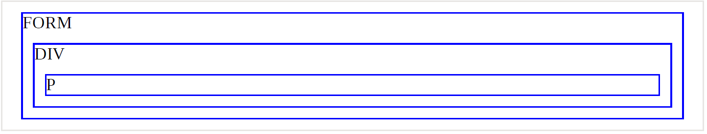
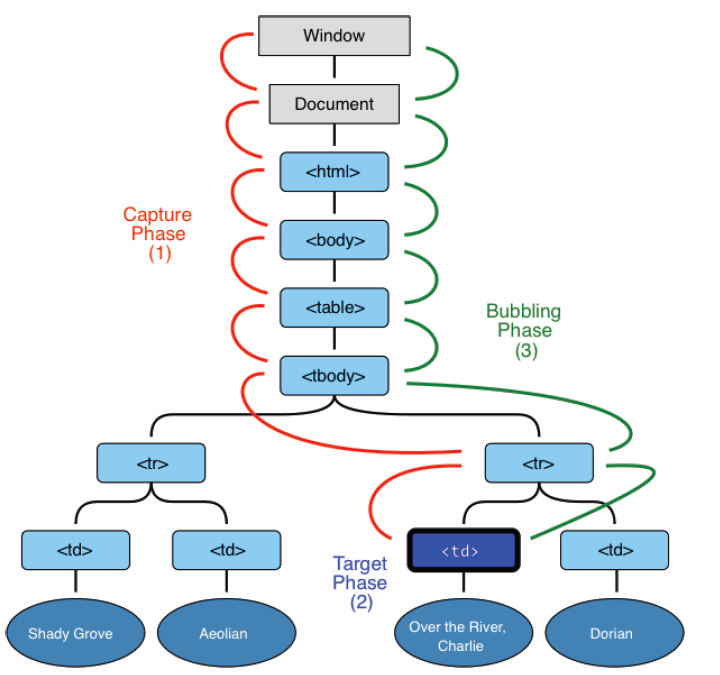

# Introduction to Events

An introduction to browser events, event properties and handling patterns.

An event is a signal that something has happened. All DOM nodes generate such signals (but events are not limited to DOM).

### Mouse events

- click – when the mouse clicks on an element (touchscreen devices generate it on a tap).

- contextmenu – when the mouse right-clicks on an element.

- mouseover / mouseout – when the mouse cursor comes over / leaves an element.

- mousedown / mouseup – when the mouse button is pressed / released over an element.

- mousemove – when the mouse is moved.

### Form element events

- submit – when the visitor submits a <form> .
- focus – when the visitor focuses on an element, e.g. on an <input> .

### Keyboard events

- keydown and keyup – when the visitor presses and then releases the button.

### Document events

- DOMContentLoaded – when the HTML is loaded and processed, DOM is fully built.

### CSS events

- transitionend – when a CSS-animation finishes.

### Event handlers

To react on events we can assign a handler – a function that runs in case of an event.

Handlers are a way to run JavaScript code in case of user actions.

There are several ways to assign a handler. Let’s see them, starting from the simplest one.

### HTML-attribute

A handler can be set in HTML with an attribute named on **<event>**.

For instance, to assign a click handler for an input , we can use onclick , like here:

 ```javascript
 <input value = "Clickme" onclick = "alert( 'Click!' ) " type="button">
 ```

``` html
<!DOCTYPE html>
<html lang="en">

<head>
    <meta charset="UTF-8">
    <meta name="viewport" content="width=device-width, initial-scale=1.0">
    <title>Document</title>
</head>

<body>
    <input type="button" onclick="countRabbits()" value="Count rabbits!">
    <script>
        function countRabbits() {
            for (let i = 1; i <= 3; i++) {
                alert("Rabbit number " + i);
            }
        }
    </script>

</body>

</html>
```

### DOM property

We can assign a handler using a DOM property on **event**
The handler is always in the DOM property: the HTML-attribute is just one of the ways to initialize it.

```html
<!DOCTYPE html>
<html lang="en">

<head>
    <meta charset="UTF-8">
    <meta name="viewport" content="width=device-width, initial-scale=1.0">
    <title>Document</title>
</head>

<body>

    <input id="elem" type="button" value="Click me">
    <script>
        elem.onclick = function () {
            alert('Thank you');
        };
    </script>
</body>

</html>
```

### 1. Only HTML

```html
<input type="button" onclick="alert('hello')" id="button" value="Button">
```

### 2. HTML + JS

``` html
<input type="button" id="button" value="Button">
<script>
button.onclick = function() {
    alert('Click!');
};
</script>
```

As there’s only one onclick property, we can’t assign more than one event handler.

In the example below adding a handler with JavaScript overwrites the existing handler:

```html
<input type="button" id="elem" onclick="alert('Before')" value="Click me">
<script>
elem.onclick = function() { // overwrites the existing handler
    alert('After'); // only this will be shown
};
</script>
```

### By the way, we can assign an existing function as a handler directly

```javascript
function sayThanks() {
    alert('Thanks!');
}
elem.onclick = sayThanks;
```

To remove a handler – assign elem.onclick = null

Accessing the element: this

The value of this inside a handler is the element. The one which has the handler on it.

In the code below button shows its contents using this.innerHTML :

```javascript
<button onclick="alert(this.innerHTML)">Click me</button>
    // Possible mistakes
    // The function should be assigned as sayThanks , not sayThanks() .
    // right
    button.onclick = sayThanks;
    // wrong
    button.onclick = sayThanks();
<input type="button" id="button" onclick="sayThanks()">
```

### Use functions, not strings

The assignment elem.onclick = "alert(1)" would work too. It works for compatibility reasons, but strongly not recommended.

 **Don’t use setAttribute for handlers**
// a click on body will generate errors,
// because attributes are always strings, function becomes a string
document.body.setAttribute('onclick', function() { alert(1) });

## addEventListener

The fundamental problem of the aforementioned ways to assign handlers – we can’t assign multiple handlers to one event.
For instance, one part of our code wants to highlight a button on click, and another one wants to show a message.
We’d like to assign two event handlers for that. But a new DOM property will overwrite the existing one:

```javascript
input.onclick = function() { alert(1); }
// ...
input.onclick = function() { alert(2); } // replaces the previous handler
```

Web-standard developers understood that long ago and suggested an alternative way of managing handlers using special methods **addEventListener** and **removeEventListener** . They are free of such a problem.
<h3 style="background:#ddd"> element.addEventListener(event, handler[, options]); </h3>

**event**
event Name e.g "click"

**handler**

the handler function

**options**

An additional optional object with properties:

- once : if true , then the listener is automatically removed after it triggers.
- capture : the phase where to handle the event, to be covered later in the
- chapter Bubbling and capturing. For historical reasons, options can also be false/true , that’s the same as {capture: false/true} .
- passive : if true , then the handler will not preventDefault() , we’ll cover that later in Browser default actions.

To remove the handler, use removeEventListener :

<h3 style="background:#212121"> element.removeEventListener(event, handler[, options]);</h3>

```javascript
elem.addEventListener( "click" , () => alert('Thanks!'));
// ....
elem.removeEventListener( "click", () => alert('Thanks!'));
```

```javascript
function handler() {
alert( 'Thanks!' );
}
input.addEventListener("click", handler);
// ....
input.removeEventListener("click", handler);
```

Please note – if we don’t store the function in a variable, then we can’t remove it. There’s no way to “read back” handlers assigned by **addEventListener**

Multiple calls to addEventListener allow to add multiple handlers, like this:

```javascript
<!DOCTYPE html>
<html lang="en">

<head>
    <meta charset="UTF-8">
    <meta name="viewport" content="width=device-width, initial-scale=1.0">
    <title>Document</title>
</head>

<body>
    <input id="elem" type="button" value="Click me" />
    <script>
        function handler1() {
            alert('Thanks!');
        };
        function handler2() {
            alert('Thanks again!');
        }
        elem.onclick = () => alert("Hello");
        elem.addEventListener("click", handler1); // Thanks!
        elem.addEventListener("click", handler2); // Thanks again!
    </script>
</body>

</html>
```

**For some events, handlers only work with addEventListener**
There exist events that can’t be assigned via a DOM-property. Must use **addEventListener**

### Event object

To properly handle an event we’d want to know more about what’s happened. Not just a “click” or a “keypress”, but what were the pointer coordinates? Which key was pressed? And so on.
When an event happens, the browser creates an event object, puts details into it and passes it as an argument to the handler.

```html
<!DOCTYPE html>
<html lang="en">

<head>
    <meta charset="UTF-8">
    <meta name="viewport" content="width=device-width, initial-scale=1.0">
    <title>Event object</title>
</head>

<body>
    <input type="button" value="Click me" id="elem">
    <script>
        elem.onclick = function (event) {
            // show event type, element and coordinates of the click
            alert(event.type + " at " + event.currentTarget);
            alert("Coordinates: " + event.clientX + ":" + event.clientY);
        };
    </script>
</body>

</html>
```

### Object handlers: handleEvent

We can assign an object as an event handler using addEventListener . When an event occurs, its handleEvent method is called with it.

```html
<!DOCTYPE html>
<html lang="en">

<head>
    <meta charset="UTF-8">
    <meta name="viewport" content="width=device-width, initial-scale=1.0">
    <title>Object handlers: handleEvent</title>
</head>

<body>
    <button id="elem">Click me</button>
    <script>
        elem.addEventListener('click', {
            handleEvent(event) {
                alert(event.type + " at " + event.currentTarget);
            }
        });
    </script>
</body>

</html>
```

In other words, when addEventListener receives an object as the handler, it calls object.handleEvent(event) in case of an event.

**Summary**
There are 3 ways to assign event handlers:

1. HTML attribute: onclick="..." .
2. DOM property: elem.onclick = function .
3. Methods: elem.addEventListener(event, handler[, phase]) to add, removeEventListener to remove.

HTML attributes are used sparingly, because JavaScript in the middle of an HTML tag looks a little bit odd and alien. Also can’t write lots of code in there.

DOM properties are ok to use, but we can’t assign more than one handler of the particular event. In many cases that limitation is not pressing.

The last way is the most flexible, but it is also the longest to write. There are few events that only work with it, for instance transtionend and *DOMContentLoaded* (to be covered). Also *addEventListener* supports objects as event handlers. In that case the method handleEvent is called in
case of the event.

No matter how you assign the handler – it gets an event object as the first argument. That object contains the details about what’s happened

### device-width

When an event happens on an element, it first runs the handlers on it, then on its parent, then all the way up on other ancestors.
Let’s say we have 3 nested elements FORM > DIV > P with a handler on each of them:

```html
<!DOCTYPE html>
<html lang="en">

<head>
    <meta charset="UTF-8">
    <meta name="viewport" content="width=device-width, initial-scale=1.0">
    <title>Bubbling</title>
    <style>
        body * {
            margin: 10px;
            border: 1px solid blue;
        }
    </style>
</head>

<body>
    <form onclick="alert('form')">FORM
        <div onclick="alert('div')">DIV
            <p onclick="alert('p')">P</p>
        </div>
    </form>

</body>

</html>
```

;

A click on the inner p first runs onclick

1. On that p.
2. Then on the outer div .
3. Then on the outer form .
4. And so on upwards till the document object.


So if we click on P then we’ll see 3 alerts: p → div → form
The process is called “bubbling”, because events “bubble” from the inner element up through parents like a bubble in the water.

**event.target**
A handler on a parent element can always get the details about where it actually happened.
*The most deeply nested element that caused the event is called a target element, accessible as event.target .*
Note the differences from this (= event.currentTarget ):

- event.target – is the “target” element that initiated the event, it doesn’t change through the bubbling process.

- this – is the “current” element, the one that has a currently running handler on it.

### Stopping bubbling

A bubbling event goes from the target element straight up. Normally it goes upwards till html , and then to document object, and some events even reach window , calling all handlers on the path.

But any handler may decide that the event has been fully processed and stop the bubbling.

- The method for it is event.stopPropagation() .
- For instance, here body.onclick doesn’t work if you click on button :

```html
<!DOCTYPE html>
<html lang="en">

<head>
    <meta charset="UTF-8">
    <meta name="viewport" content="width=device-width, initial-scale=1.0">
    <title>Stop Event Bubbling</title>
</head>

<body onclick="alert(`the bubbling doesn't reach here`)">
    <button onclick="event.stopPropagation()">Click me</button>
</body>

</html>
```

### event.stopImmediatePropagation()

If an element has multiple event handlers on a single event, then even if one of them stops the bubbling, the other ones still execute.

In other words, event.stopPropagation() stops the move upwards, but on the current element all other handlers will run.

To stop the bubbling and prevent handlers on the current element from running, there’s a method event.stopImmediatePropagation() . After it no other handlers execute.

### capturing

There’s another phase of event processing called “capturing”. It is rarely used in real code, but sometimes can be useful.

The standard [DOM Events](https://www.w3.org/TR/DOM-Level-3-Events/)  describes 3 phases of event propagation:

1. Capturing phase – the event goes down to the element.

2. Target phase – the event reached the target element.

3. Bubbling phase – the event bubbles up from the element.

Here’s the picture of a click on \<td\> inside a table, taken from the specification:


That is: for a click on *td* the event first goes through the ancestors chain down to the element (capturing phase), then it reaches the target and triggers there (target phase), and then it goes up (bubbling phase), calling handlers on its way.

**Before we only talked about bubbling, because the capturing phase is rarely
used. Normally it is invisible to us.**

Handlers added using on*event* -property or using HTML attributes or using **addEventListener(event, handler)** don’t know anything about capturing, they only run on the 2nd and 3rd phases.

To catch an event on the capturing phase, we need to set the handler capture option to true :

```html
elem.addEventListener(..., {capture: true})
// or, just "true" is an alias to {capture: true}
elem.addEventListener(..., true)
```

There are two possible values of the capture option:

- If it’s false (default), then the handler is set on the bubbling phase.

- If it’s true , then the handler is set on the capturing phase.

```html
    <!DOCTYPE html>
<html lang="en">

<head>
    <meta charset="UTF-8">
    <meta name="viewport" content="width=device-width, initial-scale=1.0">
    <title>Document</title>
    <style>
        body * {
            margin: 10px;
            border: 1px solid blue;
        }
    </style>
</head>

<body>
    <form>FORM
        <div>DIV
            <p>P</p>
        </div>
    </form>
    <script>
        for (let elem of document.querySelectorAll('*')) {
            elem.addEventListener("click", e => alert(`Capturing: ${elem.tagName}`), true);
            elem.addEventListener("click", e => alert(`Bubbling: ${elem.tagName}`));
        }
    </script>
</body>

</html>
```

1. HTML → BODY → FORM → DIV (capturing phase, the first listener):

2. P (target phrase, triggers two times, as we’ve set two listeners: capturing and bubbling)

3. DIV → FORM → BODY → HTML (bubbling phase, the second listener).

There’s a property event.eventPhase that tells us the number of the phase on which the event was caught. But it’s rarely used, because we usually know it in

### Summary

When an event happens – the most nested element where it happens gets labeled as the “target element” ( event.target ).

- Then the event moves down from the document root to event.target , calling handlers assigned with addEventListener(...., true) on the way ( true is a shorthand for {capture: true} ).

- Then handlers are called on the target element itself.

- Then the event bubbles up from event.target up to the root, calling handlers assigned using onevent and addEventListener without the 3rd argument or with the 3rd argument false/{capture:false} .

- Each handler can access event object properties: event.target – the deepest element that originated the event.

- event.currentTarget (= this ) – the current element that handles the event (the one that has the handler on it)

- event.eventPhase – the current phase (capturing=1, target=2, bubbling=3).

### Event delegation

Capturing and bubbling allow us to implement one of most powerful event handling patterns called event delegation.

In the handler we get event.target , see where the event actually happened and handle it.

**Our task is to highlight a cell \<td\> on click**.

Instead of assign an onclick handler to each \<td\> (can be many) – we’ll
setup the “catch-all” handler on \<table\> element.
It will use event.target to get the clicked element and highlight it.
The code:
