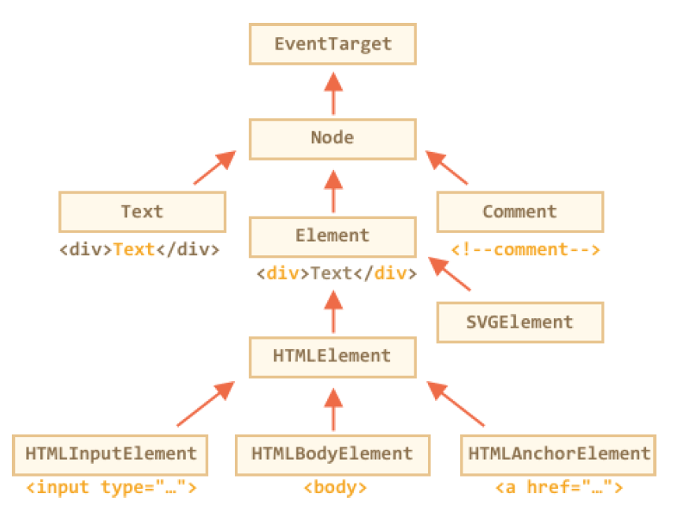

# Dom manipulation

## Searching: getElement*, querySelector*

DOM navigation properties are great when elements are close to each other.
What if they are not? How to get an arbitrary element of the page?

### **document.getElementById or just id**

If an element has the id attribute, then there’s a global variable by the name from that id .
We can use it to immediately access the element no matter where it is:

```html
<div id = "elem">
    <div id="elem-content">Element</div>
</div>
<script>
    alert(elem); // DOM-element with id="elem"
    alert(window.elem); // accessing global variable like this also works
    // for elem-content things are a bit more complex
    // that has a dash inside, so it can't be a variable name
    alert(window['elem-content']); // ...but accessible using square brackets [...]
</script>
```

The better alternative is to use a special method *document.getElementById(id)* .

```html
<div id="elem">
    <div id="elem-content">Element</div>
</div>
<script>
    let elem = document.getElementById('elem');
    elem.style.background = 'red';
</script>
```

Here in the tutorial we’ll often use id to directly reference an element, but that’s
only to keep things short. In real life document.getElementById is the preferred method.

#### There can be only one

The id must be unique. There can be only one element in the document with the given id .
Only document.getElementById , not anyNode.getElementById
The method getElementById that can be called only on document object. It looks for the given id in the whole document

## querySelectorAll

By far, the most versatile method, **elem.querySelectorAll(css)** returns all elements inside elem matching the given CSS selector.
Here we look for all `<li>` elements that are last children:

```html
<!DOCTYPE html>
<html lang="en">

    <head>
        <meta charset="UTF-8">
        <meta name="viewport" content="width=device-width, initial-scale=1.0">
        <title>Query Selector All</title>
    </head>

    <body>
        <ul>
            <li>The</li>
            <li>test</li>
        </ul>
        <ul>
            <li>has</li>
            <li>passed</li>
        </ul>
        <script>
            let elements = document.querySelectorAll('ul > li:last-child');
            for (let elem of elements) {
                alert(elem.innerHTML); // "test", "passed"
            }
        </script>
    </body>

</html>
```

This method is indeed powerful, because any CSS selector can be used

**Can use pseudo-classes as well**

Pseudo-classes in the CSS selector like :hover and :active are also supported. For instance, document.querySelectorAll(':hover') will return the collection with elements that the pointer is over now (in nesting
order: from the outermost `<html>` to the most nested one).querySelector

### querySelector

The call to **elem.querySelector(css)** returns the first element for the given CSS selector.

In other words, the result is the same as elem.querySelectorAll(css) [0] , but the latter is looking for all elements and picking one, while  elem.querySelector just looks for one. So it’s faster and shorter to write

The **[elem.matches(css) ](http://dom.spec.whatwg.org/#dom-element-matches)** does not look for anything, it merely checks if elem matches the given CSS-selector. It returns true or false .

```html
<a href="http://example.com/file.zip">...</a>
<a href="http://ya.ru">...</a>
<script>
// can be any collection instead of document.body.children
for (let elem of document.body.children) {
    if (elem.matches('a[href$="zip"]')) {
	alert("The archive reference: " + elem.href );
     }
}
</script>
```

Ancestors of an element are: parent, the parent of parent, its parent and so on.  The ancestors together form the chain of parents from the element to the top.

The method **elem.closest(css)** looks the nearest ancestor that matches the CSS-selector. The elem itself is also included in the search.

```html
<!DOCTYPE html>
<html lang="en">
  <head>
    <meta charset="UTF-8" />
    <meta name="viewport" content="width=device-width, initial-scale=1.0" />
    <title>Document</title>
  </head>
  <body>
    <h1>Contents</h1>
    <div class="contents">
      <ul class="book">
        <li class="chapter">Chapter 1</li>
        <li class="chapter">Chapter 1</li>
      </ul>
    </div>
    <script>
      let chapter = document.querySelector(".chapter"); // LI
      alert(chapter.closest(".book")); // UL
      alert(chapter.closest(".contents")); // DIV
      alert(chapter.closest("h1")); // null (because h1 is not an ancestor)
    </script>
  </body>
</html>
```

## getElementsBy*

There are also other methods to look for nodes by a tag, class, etc.
Today, they are mostly history, as querySelector is more powerful and shorter to write.
So here we cover them mainly for completeness, while you can still find them in the old scripts.

* elem.getElementsByTagName(tag) looks for elements with the given tag and returns the collection of them. The tag parameter can also be a star "*" for “any tags”.
* elem.getElementsByClassName(className) returns elements that have the given CSS class.
* document.getElementsByName(name) returns elements with the given name attribute, document-wide. very rarely used.

// get all divs in the document
**let divs = document.getElementsByTagName('div');**

```html
<!DOCTYPE html>
<html lang="en">
  <head>
    <meta charset="UTF-8" />
    <meta name="viewport" content="width=device-width, initial-scale=1.0" />
    <title>Get Elements By TagName</title>
  </head>
  <body>
    <table id="table">
      <tr>
        <td>Your age:</td>
        <td>
          <label>
            <input type="radio" name="age" value="young" checked /> less than 18
          </label>
          <label> </label>
          <label>
            <input type="radio" name="age" value="senior" /> more than 60
          </label>
        </td>
      </tr>
    </table>
    <script>
      let inputs = table.getElementsByTagName("input");
      for (let input of inputs) {
        alert(input.value + ": " + input.checked);
      }
    </script>
  </body>
</html>

```

**It returns a collection, not an element!**

// doesn't work
document.getElementsByTagName('input').value = 5;

// should work (if there's an input)
document.getElementsByTagName('input')[0].value = 5;

```html
<!DOCTYPE html>
<html lang="en">
  <head>
    <meta charset="UTF-8" />
    <meta name="viewport" content="width=device-width, initial-scale=1.0" />
    <title>Document</title>
  </head>
  <body>
    <form name="my-form">
      <div class="article">Article</div>
      <div class="long article">Long article</div>
    </form>
    <script>
      // find by name attribute
      let form = document.getElementsByName("my-form")[0];
      // find by class inside the form
      let articles = form.getElementsByClassName("article");
      alert(articles.length); // 2, found two elements with class "article"
    </script>
  </body>
</html>

```

| Method                                    | Searches by... | Can call on an element? | Live? |
| ----------------------------------------- | -------------- | ----------------------- | ----- |
| querySelector                             | CSS-selector   | ✔                      | -     |
| querySelectorAll                          | CSS-selector   | ✔                      | -     |
| getElementById                            | id             | -                       | -     |
| getElementsByName                         | name           | -                       | ✔    |
| getElementsByTagName                      | tag or '*'     | ✔                      | ✔    |
| getElementsByClassName             | class          | ✔                      | ✔    |

By far the most used are querySelector and querySelectorAll , but **getElementBy*** can be sporadically helpful or found in the old scripts. Besides that:
There is ***elem.matches(css***) to check if elem matches the given CSS selector.
There is *elem.closest(css)* to look for the nearest ancestor that matches the given **CSS-selector**. The elem itself is also checked.
And let’s mention one more method here to check for the child-parent relationship, as it’s sometimes useful:
***elemA.contains(elemB***) returns true if elemB is inside elemA (a descendant of elemA ) or when elemA==elemB .




The classes are:
[EventTarget  ](https://dom.spec.whatwg.org/#eventtarget)– is the root “abstract” class. Objects of that class are never
created. It serves as a base, so that all DOM nodes support so-called “events”, we’ll study them later.

[Node](https://dom.spec.whatwg.org/#interface-element)  – is also an “abstract” class, serving as a base for DOM nodes. It provides the core tree functionality:* **parentNode , nextSibling , childNodes*** and so on (they are getters). Objects of Node class are never created. But there are concrete node classes that inherit from it, namely: Text
for text nodes, Element for element nodes and more exotic ones like Comment for comment nodes.

[Element  ](https://dom.spec.whatwg.org/#interface-element)– is a base class for DOM elements. It provides element-level navigation like nextElementSibling , children and searching methods like getElementsByTagName , querySelector . A browser supports not only HTML, but also XML and SVG. The Element class serves as a base for more specific classes: SVGElement , XMLElement and HTMLElement .

[HTMLElement ](https://html.spec.whatwg.org/multipage/dom.html#htmlelement) – is finally the basic class for all HTML elements. It is  inherited by various HTML elements:


To see the DOM node class name, we can recall that an object usually has the constructor property. It references to the class constructor, and constructor.name is its name:

*alert( document.body.constructor.name ); // HTMLBodyElement*

*alert( document.body ); // [object HTMLBodyElement]*

We also can use instanceof to check the inheritance

alert( document.body instanceof HTMLBodyElement ); // true

alert( document.body instanceof HTMLElement ); // true

alert( document.body instanceof Element ); // true

alert( document.body instanceof Node ); // true

alert( document.body instanceof EventTarget ); // true


```html
<body>
<script>
let elem = document.body;
// let's examine what it is?
alert(elem.nodeType); // 1 => element
// and the first child is...
alert(elem.firstChild.nodeType); // 3 => text
// for the document object, the type is 9
alert( document.nodeType ); // 9
</script>
</body>
```

## Tag: nodeName and tagName

Given a DOM node, we can read its tag name from ***nodeName* **or ***tagName* **properties:

alert( document.body.nodeName ); // BODY

alert( document.body.tagName ); // BODY

```html
<body><!-- comment -->
<script>
  // for comment
  alert( document.body.firstChild.tagName ); // undefined (not an element)
  alert( document.body.firstChild.nodeName ); // #comment
  // for document
  alert( document.tagName ); // undefined (not an element)
  alert( document.nodeName ); // #document
</script>
</body
```

## ***innerHTML: the contents***

property allows to get the HTML inside the element as a string. We can also modify it. So it’s one of most powerful ways to change the page.
The example shows the contents of document.body and then replaces it completely:

```html
<!DOCTYPE html>
<html lang="en">
  <head>
    <meta charset="UTF-8" />
    <meta name="viewport" content="width=device-width, initial-scale=1.0" />
    <title>innerHTML</title>
  </head>
  <body>
    <p>A paragraph</p>
    <div>A div</div>
    <script>
      alert(document.body.innerHTML); // read the current contents
      document.body.innerHTML = "The new BODY!"; // replace it
    </script>
  </body>
</html>
```

chatDiv.innerHTML += "`<div>`Hello `` !`</div>`";

chatDiv.innerHTML += "How goes?";

But we should be very careful about doing it, because what’s going on is not an addition, but a full overwrite.

## outerHTML: full HTML of the element

The outerHTML property contains the full HTML of the element. That’s like *innerHTML* plus the element itself.

```html
<!DOCTYPE html>
<html lang="en">
  <head>
    <meta charset="UTF-8" />
    <meta name="viewport" content="width=device-width, initial-scale=1.0" />
    <title>outerHTML</title>
  </head>
  <body>
    <div id="elem">Hello <b>World</b></div>
    <script>
      alert(elem.outerHTML); // <div id="elem">Hello <b>World</b></div>
    </script>
  </body>
</html>

```

## textContent: pure text

The textContent provides access to the text inside the element: only text, minus all `<tags>` .

```html
<!DOCTYPE html>
<html lang="en">
  <head>
    <meta charset="UTF-8" />
    <meta name="viewport" content="width=device-width, initial-scale=1.0" />
    <title>text Content</title>
  </head>
  <body>
    <div id="news">
      <h1>Headline!</h1>
      <p>Martians attack people!</p>
    </div>
    <script>
      // Headline! Martians attack people!
      alert(news.textContent);
    </script>
  </body>
</html>

```

Writing to textContent is much more useful, because it allows to write text the “safe way”.

With innerHTML we’ll have it inserted “as HTML”, with all HTML tags. 

With textContent we’ll have it inserted “as text”, all symbols are treated literally.


## DOM properties

```javascript
document.body.myData = {
name: 'Caesar',
title: 'Imperator'
};
alert(document.body.myData.title); // Imperator
```

We can add a method as well:

```javascript
document.body.sayTagName = function() {
alert(this.tagName);
};
document.body.sayTagName(); // BODY (the value of "this" in the method is docum
```

We can also modify built-in prototypes like Element.prototype and add new methods to all elements:

```javascript
Element.prototype.sayHi = function() {
alert(`Hello, I'm ${this.tagName}`);
};
document.documentElement.sayHi(); // Hello, I'm HTML
document.body.sayHi(); // Hello, I'm BODY
```

So, DOM properties and methods behave just like those of regular JavaScript objects:

* They can have any value.
* They are case-sensitive (write elem.nodeType , not elem.NoDeTyPe ).

## HTML attributes

In HTML, tags may have attributes. When the browser parses the HTML to create DOM objects for tags, it recognizes standard attributes and creates DOM properties from them.

So when an element has id or another standard attribute, the corresponding property gets created. But that doesn’t happen if the attribute is non-standard. For instance:

Please note that a standard attribute for one element can be unknown for another one. 

For instance, "type" is standard for `<input>` (HTMLInputElement  ), but not for `<body>` (HTMLBodyElement  ). 

Standard attributes are described in the specification for the corresponding element class.


So, if an attribute is non-standard, there won’t be a DOM-property for it. Is there a way to access such attributes?

Sure. All attributes are accessible by using the following methods:

elem.hasAttribute(name) – checks for existence.

elem.getAttribute(name) – gets the value.

elem.setAttribute(name, value) – sets the value.

elem.removeAttribute(name) – removes the attribute.

***These methods operate exactly with what’s written in HTML.***


## DOM properties are typed

DOM properties are not always strings. For instance, the input.checked property (for checkboxes) is a boolean:
