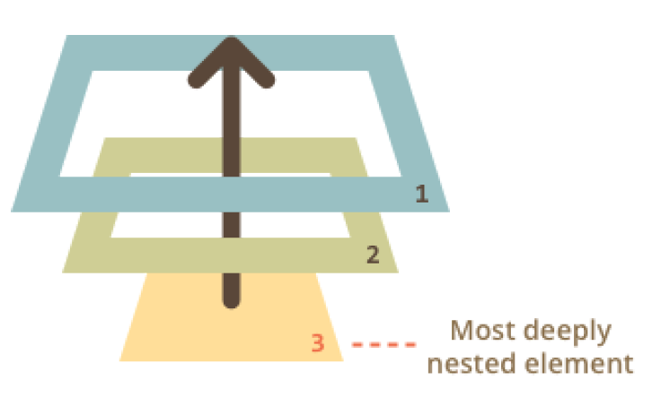

# Introduction to Events

An introduction to browser events, event properties and handling patterns.

An event is a signal that something has happened. All DOM nodes generate such signals (but events are not limited to DOM).

### Mouse events

- click – when the mouse clicks on an element (touchscreen devices generate it on a tap).
- contextmenu – when the mouse right-clicks on an element.
- mouseover / mouseout – when the mouse cursor comes over / leaves an element.
- mousedown / mouseup – when the mouse button is pressed / released over an element.
- mousemove – when the mouse is moved.

### Form element events

- submit – when the visitor submits a `<form>` .
- focus – when the visitor focuses on an element, e.g. on an `<input>` .

### Keyboard events

- keydown and keyup – when the visitor presses and then releases the button.

### Document events

- DOMContentLoaded – when the HTML is loaded and processed, DOM is fully built.

### CSS events

- transitionend – when a CSS-animation finishes.

### Event handlers

To react on events we can assign a handler – a function that runs in case of an event.

Handlers are a way to run JavaScript code in case of user actions.

There are several ways to assign a handler. Let’s see them, starting from the simplest one.

### HTML-attribute

A handler can be set in HTML with an attribute named on **`<event>`**.

For instance, to assign a click handler for an input , we can use onclick , like here:

```javascript
 <input value = "Clickme" onclick = "alert( 'Click!' ) " type="button">
```

```html
<!DOCTYPE html>
<html lang="en">

<head>
    <meta charset="UTF-8">
    <meta name="viewport" content="width=device-width, initial-scale=1.0">
    <title>Document</title>
</head>

<body>
    <input type="button" onclick="countRabbits()" value="Count rabbits!">
    <script>
        function countRabbits() {
            for (let i = 1; i <= 3; i++) {
                alert("Rabbit number " + i);
            }
        }
    </script>

</body>

</html>
```

### DOM property

We can assign a handler using a DOM property on **event**
The handler is always in the DOM property: the HTML-attribute is just one of the ways to initialize it.

```html
<!DOCTYPE html>
<html lang="en">

<head>
    <meta charset="UTF-8">
    <meta name="viewport" content="width=device-width, initial-scale=1.0">
    <title>Document</title>
</head>

<body>

    <input id="elem" type="button" value="Click me">
    <script>
        elem.onclick = function () {
            alert('Thank you');
        };
    </script>
</body>

</html>
```

### 1. Only HTML

```html
<input type="button" onclick="alert('hello')" id="button" value="Button">
```

### 2. HTML + JS

```html
<input type="button" id="button" value="Button">
<script>
button.onclick = function() {
    alert('Click!');
};
</script>
```

As there’s only one onclick property, we can’t assign more than one event handler.

In the example below adding a handler with JavaScript overwrites the existing handler:

```html
<input type="button" id="elem" onclick="alert('Before')" value="Click me">
<script>
elem.onclick = function() { // overwrites the existing handler
    alert('After'); // only this will be shown
};
</script>
```

### By the way, we can assign an existing function as a handler directly

```javascript
function sayThanks() {
    alert('Thanks!');
}
elem.onclick = sayThanks;
```

To remove a handler – assign elem.onclick = null

Accessing the element: this

The value of this inside a handler is the element. The one which has the handler on it.

In the code below button shows its contents using this.innerHTML :

```javascript
<button onclick="alert(this.innerHTML)">Click me</button>
    // Possible mistakes
    // The function should be assigned as sayThanks , not sayThanks() .
    // right
    button.onclick = sayThanks;
    // wrong
    button.onclick = sayThanks();
<input type="button" id="button" onclick="sayThanks()">
```

### Use functions, not strings

The assignment elem.onclick = "alert(1)" would work too. It works for compatibility reasons, but strongly not recommended.

 **Don’t use setAttribute for handlers**
// a click on body will generate errors,
// because attributes are always strings, function becomes a string
document.body.setAttribute('onclick', function() { alert(1) });

## addEventListener

The fundamental problem of the aforementioned ways to assign handlers – we can’t assign multiple handlers to one event.
For instance, one part of our code wants to highlight a button on click, and another one wants to show a message.
We’d like to assign two event handlers for that. But a new DOM property will overwrite the existing one:

```javascript
input.onclick = function() { alert(1); }
// ...
input.onclick = function() { alert(2); } // replaces the previous handler
```

Web-standard developers understood that long ago and suggested an alternative way of managing handlers using special methods **addEventListener** and **removeEventListener** . They are free of such a problem.

<h3 style="background:#ddd"> element.addEventListener(event, handler[, options]); </h3>

**event**
event Name e.g "click"

**handler**

the handler function

**options**

An additional optional object with properties:

- once : if true , then the listener is automatically removed after it triggers.
- capture : the phase where to handle the event, to be covered later in the
- chapter Bubbling and capturing. For historical reasons, options can also be false/true , that’s the same as {capture: false/true} .
- passive : if true , then the handler will not preventDefault() , we’ll cover that later in Browser default actions.

To remove the handler, use removeEventListener :

<h3 style="background:#212121"> element.removeEventListener(event, handler[, options]);</h3>

```javascript
elem.addEventListener( "click" , () => alert('Thanks!'));
// ....
elem.removeEventListener( "click", () => alert('Thanks!'));
```

```javascript
function handler() {
alert( 'Thanks!' );
}
input.addEventListener("click", handler);
// ....
input.removeEventListener("click", handler);
```

Please note – if we don’t store the function in a variable, then we can’t remove it. There’s no way to “read back” handlers assigned by **addEventListener**

Multiple calls to addEventListener allow to add multiple handlers, like this:

```javascript
<!DOCTYPE html>
<html lang="en">

<head>
    <meta charset="UTF-8">
    <meta name="viewport" content="width=device-width, initial-scale=1.0">
    <title>Document</title>
</head>

<body>
    <input id="elem" type="button" value="Click me" />
    <script>
        function handler1() {
            alert('Thanks!');
        };
        function handler2() {
            alert('Thanks again!');
        }
        elem.onclick = () => alert("Hello");
        elem.addEventListener("click", handler1); // Thanks!
        elem.addEventListener("click", handler2); // Thanks again!
    </script>
</body>

</html>
```

**For some events, handlers only work with addEventListener**
There exist events that can’t be assigned via a DOM-property. Must use **addEventListener**

### Event object

To properly handle an event we’d want to know more about what’s happened. Not just a “click” or a “keypress”, but what were the pointer coordinates? Which key was pressed? And so on.
When an event happens, the browser creates an event object, puts details into it and passes it as an argument to the handler.

```html
<!DOCTYPE html>
<html lang="en">

<head>
    <meta charset="UTF-8">
    <meta name="viewport" content="width=device-width, initial-scale=1.0">
    <title>Event object</title>
</head>

<body>
    <input type="button" value="Click me" id="elem">
    <script>
        elem.onclick = function (event) {
            // show event type, element and coordinates of the click
            alert(event.type + " at " + event.currentTarget);
            alert("Coordinates: " + event.clientX + ":" + event.clientY);
        };
    </script>
</body>

</html>
```

### Object handlers: handleEvent

We can assign an object as an event handler using addEventListener . When an event occurs, its handleEvent method is called with it.

```html
<!DOCTYPE html>
<html lang="en">

<head>
    <meta charset="UTF-8">
    <meta name="viewport" content="width=device-width, initial-scale=1.0">
    <title>Object handlers: handleEvent</title>
</head>

<body>
    <button id="elem">Click me</button>
    <script>
        elem.addEventListener('click', {
            handleEvent(event) {
                alert(event.type + " at " + event.currentTarget);
            }
        });
    </script>
</body>

</html>
```

In other words, when addEventListener receives an object as the handler, it calls object.handleEvent(event) in case of an event.

**Summary**
There are 3 ways to assign event handlers:

1. HTML attribute: onclick="..." .
2. DOM property: elem.onclick = function .
3. Methods: elem.addEventListener(event, handler[, phase]) to add, removeEventListener to remove.

HTML attributes are used sparingly, because JavaScript in the middle of an HTML tag looks a little bit odd and alien. Also can’t write lots of code in there.

DOM properties are ok to use, but we can’t assign more than one handler of the particular event. In many cases that limitation is not pressing.

The last way is the most flexible, but it is also the longest to write. There are few events that only work with it, for instance transtionend and *DOMContentLoaded* (to be covered). Also *addEventListener* supports objects as event handlers. In that case the method handleEvent is called in
case of the event.

No matter how you assign the handler – it gets an event object as the first argument. That object contains the details about what’s happened

### device-width

When an event happens on an element, it first runs the handlers on it, then on its parent, then all the way up on other ancestors.
Let’s say we have 3 nested elements FORM > DIV > P with a handler on each of them:

```html
<!DOCTYPE html>
<html lang="en">

<head>
    <meta charset="UTF-8">
    <meta name="viewport" content="width=device-width, initial-scale=1.0">
    <title>Bubbling</title>
    <style>
        body * {
            margin: 10px;
            border: 1px solid blue;
        }
    </style>
</head>

<body>
    <form onclick="alert('form')">FORM
        <div onclick="alert('div')">DIV
            <p onclick="alert('p')">P</p>
        </div>
    </form>

</body>

</html>
```

;

A click on the inner p first runs onclick

1. On that p.
2. Then on the outer div .
3. Then on the outer form .
4. And so on upwards till the document object.



So if we click on P then we’ll see 3 alerts: p → div → form
The process is called “bubbling”, because events “bubble” from the inner element up through parents like a bubble in the water.

**event.target**
A handler on a parent element can always get the details about where it actually happened.
*The most deeply nested element that caused the event is called a target element, accessible as event.target .*
Note the differences from this (= event.currentTarget ):

- event.target – is the “target” element that initiated the event, it doesn’t change through the bubbling process.
- this – is the “current” element, the one that has a currently running handler on it.

### Stopping bubbling

A bubbling event goes from the target element straight up. Normally it goes upwards till html , and then to document object, and some events even reach window , calling all handlers on the path.

But any handler may decide that the event has been fully processed and stop the bubbling.

- The method for it is event.stopPropagation() .
- For instance, here body.onclick doesn’t work if you click on button :

```html
<!DOCTYPE html>
<html lang="en">

<head>
    <meta charset="UTF-8">
    <meta name="viewport" content="width=device-width, initial-scale=1.0">
    <title>Stop Event Bubbling</title>
</head>

<body onclick="alert(`the bubbling doesn't reach here`)">
    <button onclick="event.stopPropagation()">Click me</button>
</body>

</html>
```

### event.stopImmediatePropagation()

If an element has multiple event handlers on a single event, then even if one of them stops the bubbling, the other ones still execute.

In other words, event.stopPropagation() stops the move upwards, but on the current element all other handlers will run.

To stop the bubbling and prevent handlers on the current element from running, there’s a method event.stopImmediatePropagation() . After it no other handlers execute.

### capturing

There’s another phase of event processing called “capturing”. It is rarely used in real code, but sometimes can be useful.

The standard [DOM Events](https://www.w3.org/TR/DOM-Level-3-Events/)  describes 3 phases of event propagation:

1. Capturing phase – the event goes down to the element.
2. Target phase – the event reached the target element.
3. Bubbling phase – the event bubbles up from the element.

Here’s the picture of a click on \<td\> inside a table, taken from the specification:


That is: for a click on *td* the event first goes through the ancestors chain down to the element (capturing phase), then it reaches the target and triggers there (target phase), and then it goes up (bubbling phase), calling handlers on its way.

**Before we only talked about bubbling, because the capturing phase is rarely
used. Normally it is invisible to us.**

Handlers added using on*event* -property or using HTML attributes or using **addEventListener(event, handler)** don’t know anything about capturing, they only run on the 2nd and 3rd phases.

To catch an event on the capturing phase, we need to set the handler capture option to true :

```html
elem.addEventListener(..., {capture: true})
// or, just "true" is an alias to {capture: true}
elem.addEventListener(..., true)
```

There are two possible values of the capture option:

- If it’s false (default), then the handler is set on the bubbling phase.
- If it’s true , then the handler is set on the capturing phase.

```html
    <!DOCTYPE html>
<html lang="en">

<head>
    <meta charset="UTF-8">
    <meta name="viewport" content="width=device-width, initial-scale=1.0">
    <title>Document</title>
    <style>
        body * {
            margin: 10px;
            border: 1px solid blue;
        }
    </style>
</head>

<body>
    <form>FORM
        <div>DIV
            <p>P</p>
        </div>
    </form>
    <script>
        for (let elem of document.querySelectorAll('*')) {
            elem.addEventListener("click", e => alert(`Capturing: ${elem.tagName}`), true);
            elem.addEventListener("click", e => alert(`Bubbling: ${elem.tagName}`));
        }
    </script>
</body>

</html>
```

1. HTML → BODY → FORM → DIV (capturing phase, the first listener):
2. P (target phrase, triggers two times, as we’ve set two listeners: capturing and bubbling)
3. DIV → FORM → BODY → HTML (bubbling phase, the second listener).

There’s a property event.eventPhase that tells us the number of the phase on which the event was caught. But it’s rarely used, because we usually know it in

### Summary

When an event happens – the most nested element where it happens gets labeled as the “target element” ( event.target ).

- Then the event moves down from the document root to event.target , calling handlers assigned with addEventListener(...., true) on the way ( true is a shorthand for {capture: true} ).
- Then handlers are called on the target element itself.
- Then the event bubbles up from event.target up to the root, calling handlers assigned using onevent and addEventListener without the 3rd argument or with the 3rd argument false/{capture:false} .
- Each handler can access event object properties: event.target – the deepest element that originated the event.
- event.currentTarget (= this ) – the current element that handles the event (the one that has the handler on it)
- event.eventPhase – the current phase (capturing=1, target=2, bubbling=3).

### Event delegation

Capturing and bubbling allow us to implement one of most powerful event handling patterns called event delegation.

In the handler we get event.target , see where the event actually happened and handle it.

**Our task is to highlight a cell \<td\> on click**.

Instead of assign an onclick handler to each \<td\> (can be many) – we’ll setup the “catch-all” handler on \<table\> element.
It will use event.target to get the clicked element and highlight it. The code:

In the handler we get event.target , see where the event actually happened and handle it.

```html
<!DOCTYPE html>
<html lang="en">

<head>
    <meta charset="UTF-8">
    <meta name="viewport" content="width=device-width, initial-scale=1.0">
    <title>Document</title>
</head>

<body>
    <table id="table">
        <tr border="1">
            <th colspan="3"><em>Bagua</em> Chart: Direction, Element, Color, Meaning</th>
        </tr>
        <tr>
            <td>...<strong>Northwest</strong>...</td>
            <td>...</td>
            <td>...</td>
        </tr>
        <tr>...2 more lines of this kind...</tr>
        <tr>...2 more lines of this kind...</tr>
    </table>

    <script>
        let selectedTd;
        let table = document.getElementById("table");
        table.onclick = function (event) {
            let target = event.target; // where was the click?
            if (target.tagName != 'TD') return; // not on TD? Then we're not interested
            highlight(target); // highlight it
        };
        function highlight(td) {
            if (selectedTd) { // remove the existing highlight if any
                selectedTd.classList.remove('highlight');
            }
            selectedTd = td;
            selectedTd.classList.add('highlight'); // highlight the new td
        }
    </script>
</body>

</html>
```


Such a code doesn’t care how many cells there are in the table. We can add/remove `<td>` dynamically at any time and the highlighting will still work.
Still, there’s a drawback. The click may occur not on the `<td>` , but inside it. In our case if we take a look inside the HTML, we can see nested tags inside

```html
<td>
	<strong>Northwest</strong>
...
</td>
```


Naturally, if a click happens on that `<strong>` then it becomes the value of event.target .


In the handler table.onclick we should take such event.target and find out whether the click was inside `<td>` or not.
Here’s the improved code:

```html
table.onclick = function(event) {
let td = event.target.closest('td'); // (1)
if (!td) return; // (2)
if (!table.contains(td)) return; // (3)
highlight(td); // (4)
};
```


1. The method elem.closest(selector) returns the nearest ancestor that matches the selector. In our case we look for `<td>` on the way up from the source element.
2. If event.target is not inside any `<td>` , then the call returns null , and we don’t have to do anything.
3. In case of nested tables, event.target may be a `<td>` lying outside of the current table. So we check if that’s actually our table’s `<td>` .
4. And, if it’s so, then highlight it.

**Delegation example: actions in markup**

The event delegation may be used to optimize event handling. We use a single handler for similar actions on many elements. Like we did it for highlighting `<td>` .

But we can also use a single handler as an entry point for many different things. For instance, we want to make a menu with buttons “Save”, “Load”, “Search” and  so on. 

And there’s an object with methods save , load , search …. The first idea may be to assign a separate handler to each button. But there’s a more elegant solution.

We can add a handler for the whole menu and dataaction attributes for buttons that has the method to call:

```html
<!DOCTYPE html>
<html lang="en">
  <head>
    <meta charset="UTF-8" />
    <meta name="viewport" content="width=device-width, initial-scale=1.0" />
    <title>Event Delegation 2</title>
  </head>
  <body>
    <div id="menu">
      <button data-action="save">Save</button>
      <button data-action="load">Load</button>
      <button data-action="search">Search</button>
    </div>
    <script>
      class Menu {
        constructor(elem) {
          this._elem = elem;
          elem.onclick = this.onClick.bind(this); // (*)
        }
        save() {
          alert("saving");
        }
        load() {
          alert("loading");
        }
        search() {
          alert("searching");
        }
        onClick(event) {
          let action = event.target.dataset.action;
          if (action) {
            this[action]();
          }
        }
      }
      new Menu(menu);
    </script>
  </body>
</html>

```

Please note that **this.onClick** is bound to this in **(*)** . That’s important, because otherwise this inside it would reference the DOM element ( elem ), not the menu object, and **this[action]** would not be what we need.  So, what the delegation gives us here?

We could also use classes .**action-save , .action-load** , but an attribute **data-action** is better semantically. And we can use it in CSS rules too.

**Counter**

For instance, here the attribute data-counter adds a behavior: “increase value on click” to buttons:

```html
<!DOCTYPE html>
<html lang="en">
  <head>
    <meta charset="UTF-8" />
    <meta name="viewport" content="width=device-width, initial-scale=1.0" />
    <title>EventDelegation</title>
  </head>
  <body>
    Counter: <input type="button" value="1" data-counter /> One more counter:
    <input type="button" value="2" data-counter />
    <script>
      document.addEventListener("click", function (event) {
        if (event.target.dataset.counter != undefined) {
          // if the attribute exists..
          event.target.value++;
        }
      });
    </script>
  </body>
</html>

```


If we click a button – its value is increased. Not buttons, but the general approach is important here.

There can be as many attributes with **data-counter** as we want. We can add new ones to HTML at any moment. Using the event delegation we “extended” HTML, added an attribute that describes a new behavior.


**Toggler**


One more example. A click on an element with the attribute **data-toggle-id** will show/hide the element with the **given id** :

```html
<!DOCTYPE html>
<html lang="en">
  <head>
    <meta charset="UTF-8" />
    <meta name="viewport" content="width=device-width, initial-scale=1.0" />
    <title>Event Delegation</title>
  </head>
  <body>
    <button data-toggle-id="subscribe-mail">Show the subscription form</button>
    <form id="subscribe-mail" hidden>Your mail: <input type="email" /></form>
    <script>
      document.addEventListener("click", function (event) {
        let id = event.target.dataset.toggleId;
        if (!id) return;
        let elem = document.getElementById(id);
        elem.hidden = !elem.hidden;
      });
    </script>
  </body>
</html>

```

Let’s note once again what we did. Now, to add toggling functionality to an element – there’s no need to know JavaScript, just use the attribute **datatoggle-id** .

That may become really convenient – no need to write JavaScript for every such element. Just use the behavior. The document-level handler makes it work for any element of the page.

We can combine multiple behaviors on a single element as well. The “behavior” pattern can be an alternative of mini-fragments of JavaScript.

## Summary

Event delegation is really cool! It’s one of the most helpful patterns for DOM events.

It’s often used to add same handling for many similar elements, but not only for that.

The algorithm:

1. Put a single handler on the container.
2. In the handler – check the source element event.target .
3. If the event happened inside an element that interests us, then handle the event.

Benefits:

Simplifies initialization and saves memory: no need to add many handlers.

Less code: when adding or removing elements, no need to add/remove handlers.

DOM modifications: we can mass add/remove elements with innerHTML and alike.

**The delegation has its limitations of course:**

1. First, the event must be bubbling. Some events do not bubble. Also, low-level handlers should not use **event.stopPropagation()** .
2. Second, the delegation may add CPU load, because the container-level handler reacts on events in any place of the container, no matter if they
   interest us or not. But usually the load is negligible, so we don’t take it into account.

## Preventing browser actions

There are two ways to tell the browser we don’t want it to act:

1. The main way is to use the event object. There’s a method **event.preventDefault()** .
2. If the handler is assigned using on `<event>` (not by addEventListener ), then we can just return false from it.

In the example below a click to links doesn’t lead to URL change:

```javascript
<a href="/" onclick="return false">Click here</a>
or
<a href="/" onclick="event.preventDefault()">here</a>
```

```html
<!DOCTYPE html>
<html lang="en">
  <head>
    <meta charset="UTF-8" />
    <meta name="viewport" content="width=device-width, initial-scale=1.0" />
    <title>prevent browser default Actions</title>
  </head>
  <body>
    <ul id="menu" class="menu">
      <li><a href="/html">HTML</a></li>
      <li><a href="/javascript">JavaScript</a></li>
      <li><a href="/css">CSS</a></li>
    </ul>

    <script>
      menu.onclick = function (event) {
        if (event.target.nodeName != "A") return;
        let href = event.target.getAttribute("href");
        alert(href); // ...can be loading from the server, UI generation etc
        return false; // prevent browser action (don't go to the URL)
      };
    </script>
  </body>
</html>

```


### Prevent further events

Certain events flow one into another. If we prevent the first event, there will be no second.

For instance, mousedown on an `<input>` field leads to focusing in it, and the focus event. If we prevent the mousedown event, there’s no focus.
Try to click on the first `<input>` below – the focus event happens. That's normal. But if you click the second one, there’s no focus.

```html
<input value="Focus works" onfocus="this.value=''">
<input onmousedown="return false" onfocus="this.value=''" value="Click me">
```

That’s because the browser action is canceled on mousedown . The focusing is still possible if we use another way to enter the input. For instance, the Tab key to switch from the 1st input into the 2nd. But not with the mouse click any more.

**The “passive” handler option**

The optional passive: true option of addEventListener signals the browser that the handler is not going to call **preventDefault()** . Why that may be needed?

### event.defaultPrevented

The property **event.defaultPrevented** is true if the default action was  prevented, and false otherwise.

```html
<button>Right-click for browser context menu</button>
<button oncontextmenu="alert('Draw our menu'); return false">
Right-click for our context menu
</button>
```

```html
<p>Right-click here for the document context menu</p>
<button id="elem">Right-click here for the button context menu</button>
<script>
elem.oncontextmenu = function(event) {
event.preventDefault();
alert("Button context menu");
};
document.oncontextmenu = function(event) {
event.preventDefault();
alert("Document context menu");
};
</script>
```

**event.stopPropagation() and event.preventDefault()**

As we can clearly see, **event.stopPropagation() and event.preventDefault()** (also known as return false ) are two different things. They are not related to each other.

## Dispatching custom events

We can not only assign handlers, but also generate events from JavaScript.

Custom events can be used to create “graphical components”. For instance, a root element of the menu may trigger events telling what happens with the menu:  open (menu open), select (an item is selected) and so on.

**Event constructor**

Events form a hierarchy, just like DOM element classes. The root is the built-in [Event  ](www.w3.org/TR/dom/#event)class.

```html
let event = new Event(event type[, options]);
```

Arguments:

    event type – may be any string, like "click" or our own like "hey-ho!" .

  options – the object with two optional properties:

    bubbles: true/false – if true , then the event bubbles.

    cancelable: true/false – if true , then the “default action” may be prevented. Later we’ll see what it means for custom events.

By default both are false: {bubbles: false, cancelable: false

**dispatchEvent**

After an event object is created, we should “run” it on an element using the call **elem.dispatchEvent(event)**

Then handlers react on it as if it were a regular built-in event. If the event was created with the bubbles flag, then it bubbles.

```html
<button id="elem" onclick="alert('Click!');">Autoclick</button>
<script>
let event = new Event("click");
elem.dispatchEvent(event);
</script>
```
